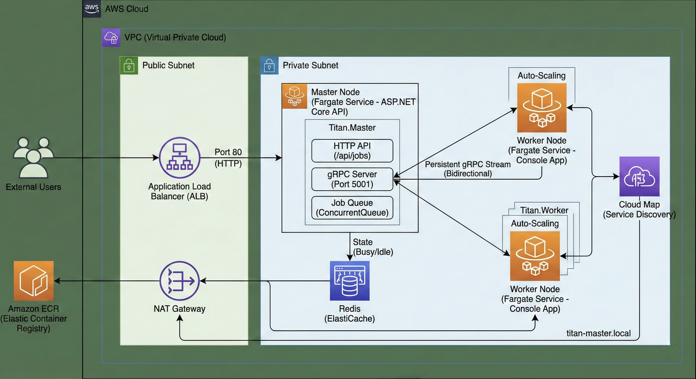

# Titan Orchestrator

Titan Orchestrator is a distributed job orchestration system built with **.NET 8**, **gRPC**, and **Redis**. It demonstrates a high-performance, cloud-native architecture using the "Master-Worker" pattern, deployed via **AWS Fargate**.

## 🏗️ Architecture



The system is architected for security and scalability using AWS best practices:

* **Public Subnet**: Hosts the **Application Load Balancer (ALB)**, which serves as the secure entry point for external HTTP traffic.
* **Private Subnet (The "Vault")**:
    * **Master Node**: An ASP.NET Core API that manages the job queue and orchestrates workers via a persistent, bi-directional gRPC stream.
    * **Worker Nodes**: Auto-scaling console applications that run in isolation. They have no public IP and reach the internet (for ECR pulls) only via a **NAT Gateway**.
    * **Redis**: Provides distributed state management, accessible only by the Master node.

## 🚀 Running Locally

You can run the entire system locally using Docker Compose to simulate the distributed environment.

1.  **Prerequisites**: Ensure you have Docker and Docker Compose installed.
2.  **Run**:
    ```bash
    docker-compose up --build
    ```
3.  **Access**:
    - **Master HTTP API**: `http://localhost:5050`
    - **Master gRPC**: `http://localhost:5001`
    - **Redis**: `localhost:6379`

### How to Test
Submit a job to the Master via `curl`:
```bash
curl -X POST http://localhost:5050/api/jobs \
  -H "Content-Type: application/json" \
  -d '{"payload": "Process Image A"}'
  ```

## 🚀 Production Roadmap
This project is a **Proof of Concept (PoC)** designed to demonstrate distributed system patterns in .NET 8. To graduate this to a production environment, the following improvements would be prioritized:

1.  **Durability:** Replace the in-memory `ConcurrentQueue` with **Amazon SQS** or **Redis Streams** to ensure jobs survive a Master node restart.
2.  **Security:** Implement **mTLS** (Mutual TLS) for the gRPC channel to encrypt traffic between Master and Workers.
3.  **Observability:** Integrate **OpenTelemetry** to trace requests from the Load Balancer -> Master -> Redis -> Worker.
4.  **Identity:** Add **OIDC Authentication** (e.g., Auth0 or AWS Cognito) to the REST API.